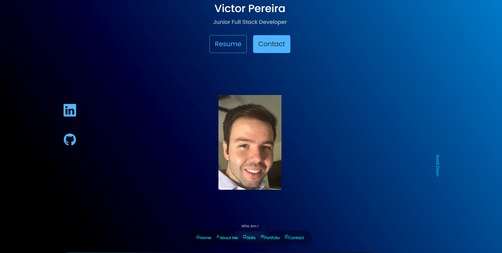
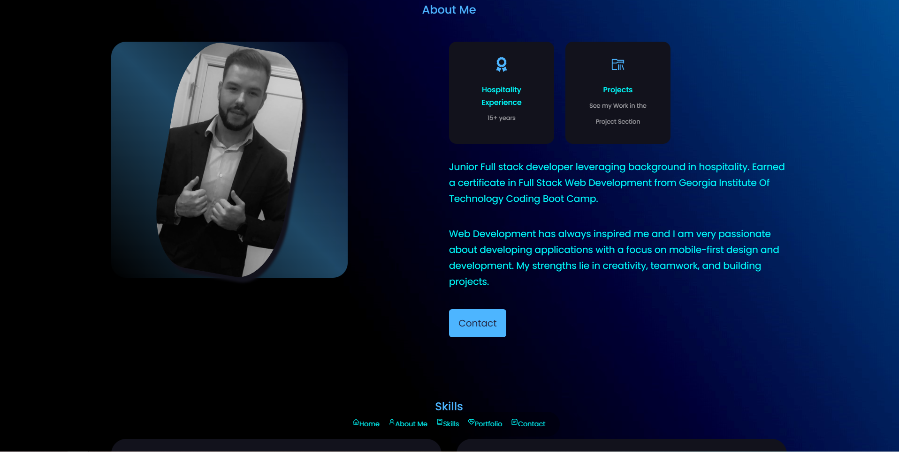
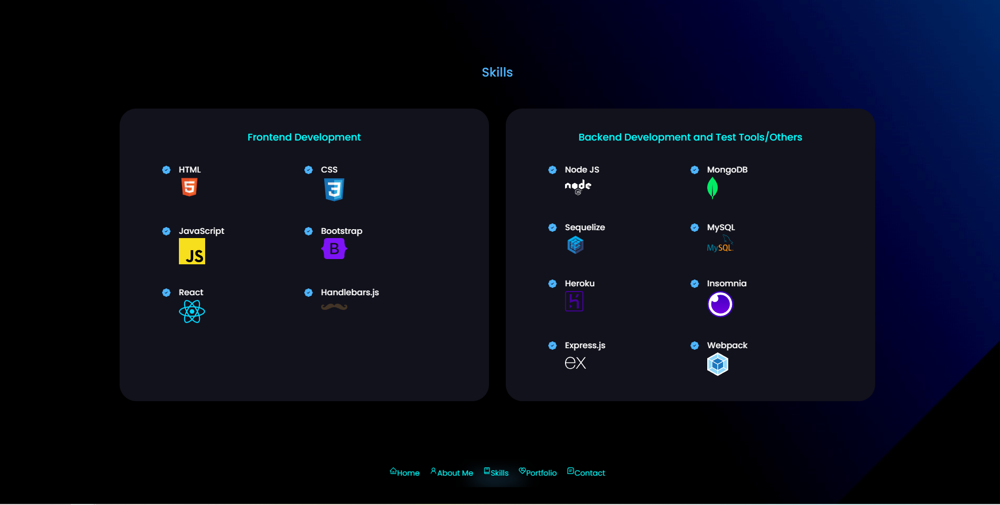
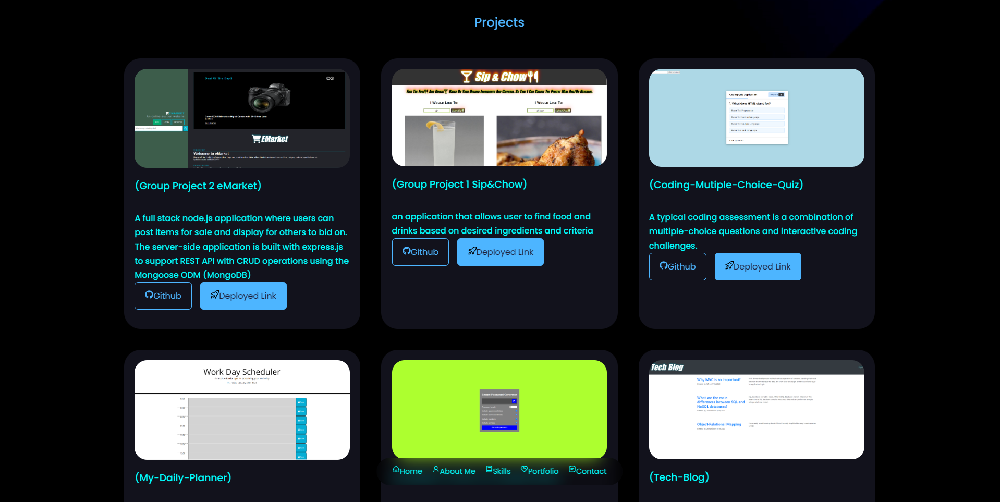
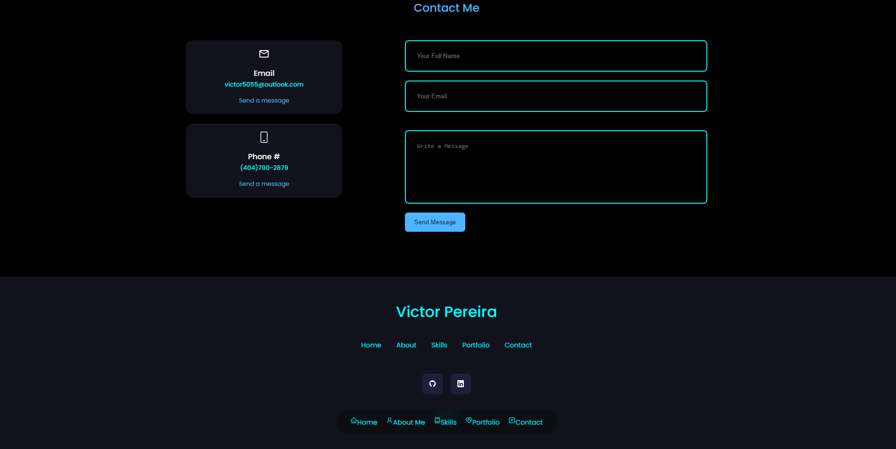

# react-portfolio-
This portfolio is a single page application built up by using React, React icons, HTML, CSS3 and a place to share my projects with developers and to collaborate on the projects.

[Deployed Application](https://victor5055.github.io/react-portfolio-/)

## Table of Contents
*[Description of Repository](#Repository-Description)

*[User-Story](#User-Story)

*[Contribution-Guidelines](#Contribution-Guidelines)

*[Repositiory-End-Goal-Criterea](#Repositiory-End-Goal-Criterea)

*[License](#License)

*[Contact](#Contact)
    
 # Repository-Description
###### [Back to Table of Contents](#Table-of-Contents)
AS AN employer looking for candidates with experience building single-page applications
I WANT to view a potential employee's deployed React portfolio of work samples
SO THAT I can assess whether they're a good candidate for an open position

    
## User-Story
### As the Developer
###### [Back to Table of Contents](#Table-of-Contents)
GIVEN a single-page application portfolio for a web developer
WHEN I load the portfolio
THEN I am presented with a page containing a header, a section for content, and a footer
WHEN I view the header
THEN I am presented with the developer's name and navigation with titles corresponding to different sections of the portfolio
WHEN I view the navigation titles
THEN I am presented with the titles About Me, Portfolio, Contact, and Resume, and the title corresponding to the current section is highlighted
WHEN I click on a navigation title
THEN I am presented with the corresponding section below the navigation without the page reloading and that title is highlighted
WHEN I load the portfolio the first time
THEN the About Me title and section are selected by default
WHEN I am presented with the About Me section
THEN I see a recent photo or avatar of the developer and a short bio about them
WHEN I am presented with the Portfolio section
THEN I see titled images of six of the developer’s applications with links to both the deployed applications and the corresponding GitHub repositories
WHEN I am presented with the Contact section
THEN I see a contact form with fields for a name, an email address, and a message
WHEN I move my cursor out of one of the form fields without entering text
THEN I receive a notification that this field is required
WHEN I enter text into the email address field
THEN I receive a notification if I have entered an invalid email address
WHEN I am presented with the Resume section
THEN I see a link to a downloadable resume and a list of the developer’s proficiencies
WHEN I view the footer
THEN I am presented with text or icon links to the developer’s GitHub and LinkedIn profiles, and their profile on a third platform (Stack Overflow, Twitter)

## Contribution-Guidelines
###### [Back to Table of Contents](#Table-of-Contents)
none

## Installation
###### [Back to Table of Contents](#Table-of-Contents)
1. This portfolio application requires the installation of node.js and the node package manager(npm) which is a software manager and installer which places the modules so that the node project can utilize it, and also, it manages dependency conflicts intelligently and initialized using **npm init**". The package.json will be generated and will contains all the packages of the application in which the user have inputted during the npm initialization.

2. This react application is created by entering at command prompt: 
-npx create-react-app 20S-react-portfolio
-npm install
-npm start (run the apps in the development and http://localhost:3000 to view it in the browser)
-npm install react-icons --save (for including the popular icons easily with react-icons which utilizes ES6 imports that allows inclusion of icons for this application)
-https://iconify.design/ (for my popular icon sets used in skills)
-npm install @emailjs/browser
-npm run build (builds the app for production to the folder to correctly bundles React in production mode and optimizes the build for the best performance)

## Overview: What Was Accomplished!
### Workflow [Back to Table of Contents](#Table-of-Contents)
I have deployed a succesful single-page application

### Screenshots (Building this application)
###### [Back to Table of Contents](#Table-of-Contents)

    

## Repositiory-End-Goal-Criterea
###### [Back to Table of Contents](#Table-of-Contents)
Stay on Task
    
## License
MIT
* For more information on license types, please reference this website
for additional licensing information - [https: //choosealicense.com/](https://choosealicense.com/).

    
## Contact
* Github Username: victor5055
* Github Profile link:(https://github.com/victor5055)
* Email: victor5055@outlook.com

Permission is hereby granted, free of charge, to any person obtaining a copy of this software and associated documentation files (the "Software"), to deal in the Software without restriction, including without limitation the rights to use, copy, modify, merge, publish, distribute, sublicense, and/or sell copies of the Software, and to permit persons to whom the Software is furnished to do so, subject to the following conditions:

The above copyright notice and this permission notice shall be included in all copies or substantial portions of the Software.

THE SOFTWARE IS PROVIDED "AS IS", WITHOUT WARRANTY OF ANY KIND, EXPRESS OR IMPLIED, INCLUDING BUT NOT LIMITED TO THE WARRANTIES OF MERCHANTABILITY, FITNESS FOR A PARTICULAR PURPOSE AND NONINFRINGEMENT. IN NO EVENT SHALL THE AUTHORS OR COPYRIGHT HOLDERS BE LIABLE FOR ANY CLAIM, DAMAGES OR OTHER LIABILITY, WHETHER IN AN ACTION OF CONTRACT, TORT OR OTHERWISE, ARISING FROM, OUT OF OR IN CONNECTION WITH THE SOFTWARE OR THE USE OR OTHER DEALINGS IN THE SOFTWARE.
